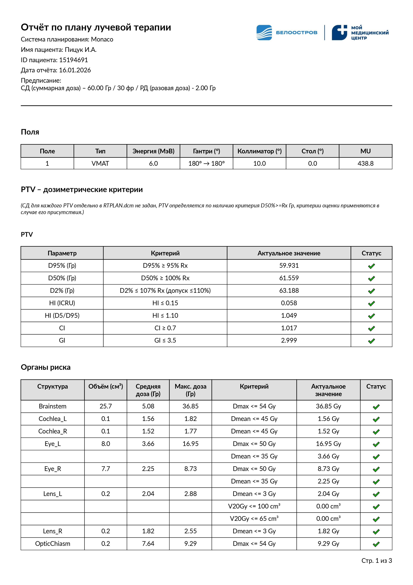
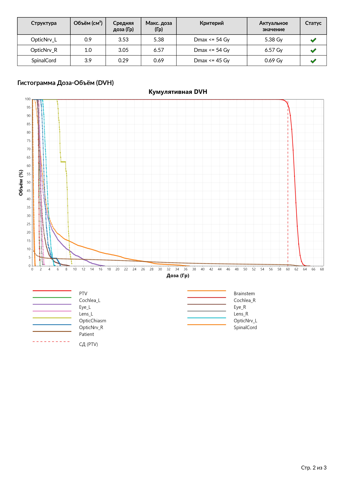
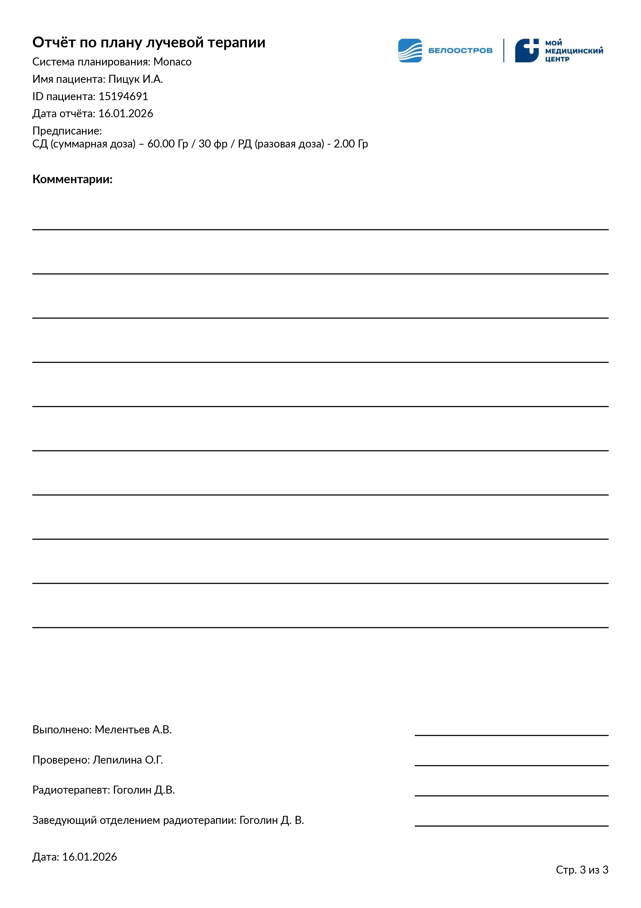

# PDF Report

Консольное приложение на **C# / .NET 8** для анализа DICOM-данных плана лучевой терапии и формирования PDF-отчёта в стиле Monaco.

Программа читает `RTPLAN`, `RTDOSE` и `RTSTRUCT`, рассчитывает кумулятивные DVH и дозиметрические показатели PTV, проверяет критерии для органов риска из Monaco JSON, строит DVH-график и формирует итоговый многостраничный PDF через QuestPDF.

> **Статус проекта:** рабочий прототип в активной разработке. Перед использованием результатов в клиническом процессе требуется локальная валидация расчётов и сопоставление с TPS.

## Возможности

- автоматический поиск `RTPLAN`, `RTDOSE` и `RTSTRUCT` в выбранной папке;
- чтение 3D dose grid из RTDOSE в Gy;
- чтение ROI-контуров из RTSTRUCT;
- чтение параметров полей, MU и фракционирования из RTPLAN;
- воксельный расчёт кумулятивного DVH;
- пропуск структур, для которых на дозовой сетке не найдено ни одного подходящего вокселя, без аварийного завершения всей обработки;
- расчёт PTV-метрик: `D2`, `D5`, `D50`, `D95`, `D98`, `HI (ICRU)`, `HI (D5/D95)`, `CI`, `GI`;
- импорт dose goals из Monaco JSON;
- оценка OAR-критериев `Dmax`, `Dmean`, `Dxx%`, `Dxx cm³`, `VxGy`;
- статусы Pass / Warning / Fail;
- построение DVH-графика с отдельными кривыми структур и Rx-линиями PTV;
- генерация PDF-отчёта с параметрами полей, PTV, OAR, DVH, комментариями и подписями.

## Текущий pipeline

```text
DICOM folder
   |
   +-- RTPLAN  ------> beams / MU / fractions
   +-- RTDOSE  ------> 3D dose grid
   +-- RTSTRUCT -----> ROI contours
                         |
                         v
                   DVH calculation
                         |
              +----------+----------+
              |                     |
              v                     v
         PTV analysis           OAR analysis
              |                     |
              +----------+----------+
                         |
                         v
                    DVH plot
                         |
                         v
                    PDF report
```

Дополнительно программа получает Monaco JSON с дозиметрическими критериями. Имена структур сопоставляются после нормализации регистра и удаления пробелов, `_`, `-` и `.`.

## PTV и Rx

Структура рассматривается как кандидат PTV, если её имя содержит `PTV`.

Для включения PTV в анализ программа:

1. ищет соответствующую структуру в Monaco JSON;
2. ищет dose goal вида `D50% >= Rx Gy`;
3. использует значение этого критерия как Rx конкретного PTV;
4. число фракций берёт из RTPLAN, если оно доступно.

Если `D50% >= Rx Gy` отсутствует, PTV не включается в таблицу PTV-критериев.

Текущие правила PTV:

| Метрика | Критерий |
|---|---|
| D95% | `>= 95% Rx` |
| D50% | `>= 100% Rx` |
| D2% | `<= 107% Rx`, warning до `110% Rx` |
| HI ICRU | `<= 0.15` |
| HI D5/D95 | `<= 1.10` |
| CI | `>= 0.7` |
| GI | `<= 3.5` |

## OAR

Критерии органов риска читаются из Monaco JSON и переводятся в `OarCriterion`.

Поддерживаются:

- `Dmax`;
- `Dmean`;
- `Dxx%`;
- `Dxx cm³`;
- `VxGy` с результатом в `%` или `cm³`.

Сопоставление OAR из RTSTRUCT и JSON выполняется по нормализованному имени структуры.

## Расчёт DVH

`DVHCalculator` перебирает воксели RTDOSE, сопоставляет положение центра вокселя с контуром ROI и строит кумулятивную DVH.

В актуальной версии:

- поиск ближайшего контура по Z выполняется с допуском **2.5 мм**;
- если для структуры не найдено дозовых вокселей, метод возвращает `null`, пишет предупреждение в консоль и анализ продолжается для остальных структур;
- кумулятивная DVH строится по 200 bins.

## Структура проекта

```text
Program.cs                      orchestration / CLI

DicomDoseVolume.cs              RTDOSE
DicomStructureSet.cs            RTSTRUCT
DicomPlanReader.cs              RTPLAN beams / MU
DicomPrescriptionExtractor.cs   RTPLAN prescription / fractions
DoseReferenceReader.cs          DoseReferenceSequence reader

DVHCalculator.cs                voxel-based DVH calculation
DVHResult.cs                    DVH model and basic metrics
DVHExtensions.cs                DVH helper methods
RoiGeometry.cs                  ROI geometry helpers

PTVMetrics.cs                   PTV metric model
PTVMetricsCalculator.cs         D*, HI, CI, GI
PTVRxInfo.cs                    Rx model
ClinicalRules.cs                PTV clinical rules

MonacoCriteriaModels.cs         Monaco JSON DTO
OarCriterion.cs                 OAR criterion model
OarClinicalRules.cs             active OAR evaluator

DoseConstraint.cs               alternative / legacy constraint model
JsonCriteriaParser.cs           parser for DoseConstraint
OarCriteriaEvaluator.cs         evaluator for DoseConstraint

DvhPlotter.cs                   ScottPlot DVH rendering
MonacoLikeReport.cs             QuestPDF report
PassFailResult.cs               criterion evaluation result
```

## Зависимости

- .NET 8;
- `fo-dicom 5.2.5`;
- `QuestPDF 2025.12.2`;
- `ScottPlot 5.1.57`;
- `System.Drawing.Common 10.0.2`;
- `iTextSharp 5.5.13.4` — зависимость пока остаётся в `.csproj`, хотя актуальная генерация отчёта выполняется через QuestPDF.

## Запуск

Откройте `PDF Report Final.sln` в Visual Studio 2022 или соберите проект через .NET 8 SDK.

Программа запрашивает:

1. папку с DICOM (`RTPLAN`, `RTDOSE`, `RTSTRUCT`);
2. папку с Monaco JSON;
3. имя пациента;
4. ID пациента;
5. исполнителя;
6. проверяющего;
7. радиотерапевта.

PDF и PNG с DVH сохраняются на рабочий стол.

## Пример получаемого отчёта

> **Важно:** представленный ниже отчёт является исключительно демонстрационным примером внешнего вида. **Все ФИО, ID пациента, подписи, даты, дозы, дозиметрические показатели и другие персональные или медицинские данные в примере являются случайными (рандомными).** Они не относятся к реальному пациенту и не предназначены для клинической интерпретации.

**[📄 Открыть пример отчёта целиком в PDF](examples/65.pdf)**

### Страница 1 — параметры плана, PTV и органы риска

[](examples/65_pages-to-jpg-0001.jpg)

### Страница 2 — органы риска и DVH

[](examples/65_pages-to-jpg-0002.jpg)

### Страница 3 — комментарии и подписи

[](examples/65_pages-to-jpg-0003.jpg)

## Известные ограничения и технический долг

Текущая версия уже генерирует рабочий отчёт, но архитектурно остаётся прототипом:

- `Program.cs` одновременно выполняет CLI, загрузку файлов, сопоставление структур, PTV/Rx-логику, orchestration расчётов и подготовку отчёта;
- существуют две модели OAR-критериев: активная `OarCriterion + OarClinicalRules` и альтернативная `DoseConstraint + OarCriteriaEvaluator`;
- `PointInPolygon` частично дублируется между `DVHCalculator` и `RoiGeometry`;
- DVH строится на дискретной сетке bins, поэтому точность метрик зависит от текущего алгоритма дискретизации;
- обработка сложной ROI-геометрии и нескольких контуров на одном Z требует отдельной валидации;
- CI/GI и остальные метрики необходимо систематически сравнивать с результатами Monaco на репрезентативном наборе планов;
- пока нет полноценного набора автоматических unit/integration tests и CI-сборки расчётного ядра.

## План развития

Ближайшее архитектурное направление — выделение application layer, чтобы `Program` отвечал только за ввод/вывод и запуск use-case.

```text
CLI
 |
 v
PlanAnalysisService
 |-- DICOM loading
 |-- DVH analysis
 |-- PTV evaluation
 |-- OAR evaluation
 +-- AnalysisResult
          |
          +--> DVH plot
          +--> PDF report
```

После этого расчётное ядро можно будет использовать независимо от консольного интерфейса — например, из GUI, API или автоматизированного сервиса.

## Дисклеймер

Проект разрабатывается как инструмент анализа и автоматизации отчётности. Расчётные результаты должны быть валидированы пользователем и учреждением перед применением в клиническом workflow.
